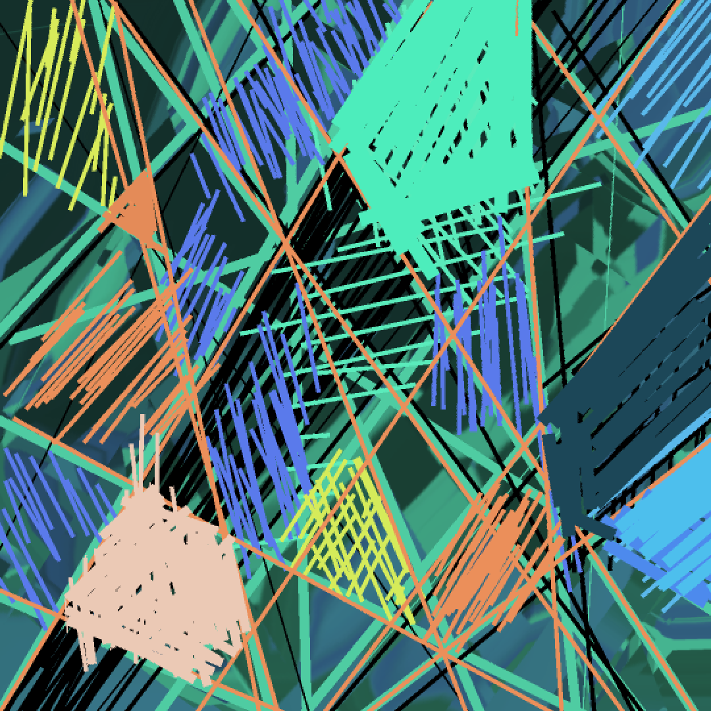

# quantum-lens-desktop  
UQD Lens filter is for Unlimited Quantum Divergence Lens filter, Audioprocessing Electron app, v 2.1.0  

Yet at UQD creation, an app was tested working only on Windows. Build on your own risque.  
UI working satisfiable, but in standard window menues still some minor bugs.  

Idea of app coming from exploration Quantum Divergence Barrier at commonly odd formulae  
& Optical Relative Transmission part of Aalener Optik-Formelrechner thesis,  
legendary works of Emma Neuter and strongest will of my mom and all her best friends. 🌿💮  

  

# ⚛️ UQD Lens Audio Processor  

**Optical raytracing meets audio filtering. Divergent barrier: ∫ 1/|x| dx = ∞**  

Based on optical formulas from Aalener Optik-Formelrechner.  

## Features  
- 🧹 **Lens Mode**: Smooth, clean filtering for noise reduction  
- ⚡ **Barrier Mode**: Divergent barrier (p=1.0 gives infinite slope at cutoff)  
- 🔬 Presets for real lens materials (CR-39, Polycarbonate, High-index, Crown, Flint)  
- 📊 Real-time frequency response plot  
- 🎚️ Interactive knob controls  
- 📁 Load any audio (WAV, MP3, FLAC, OGG)  
- 💾 Export processed audio as WAV  

## Install & Run  

```bash  
git clone https://github.com/yus/quantum-lens-desktop.git  
cd quantum-lens-desktop  
npm install  
npm start  
```  

## Build Standalone App  

```bash  
npm run build:win   # Windows .exe  
npm run build:mac   # macOS .dmg  
npm run build:linux # Linux AppImage  
```  

## License  
MIT + Aalener Optik-Formelrechner (GPL v3)  
